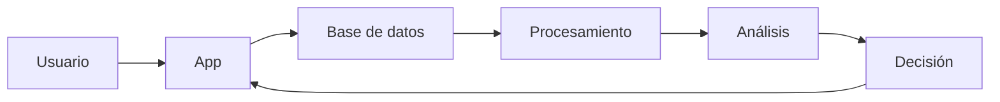

# Práctica RA5 · a+b — Datos e información

## 1) Caso
- Sistema: Plataforma de streaming (tipo Netflix)  
- Contexto: Usuarios consumen contenido (series y películas) y la plataforma recopila datos para mejorar la experiencia y tomar decisiones.

## 2) Datos
- ID de usuario  
- Título reproducido  
- Tiempo de visualización  
- Hora y día de uso  
- Dispositivo utilizado  
- Valoración (like/dislike)  
- Ubicación del usuario  

## 3) Información
- Series más vistas en una región  
- Horas con mayor actividad de usuarios  
- Recomendaciones personalizadas  
- Contenido con mayor abandono  

## 4) Diferencia
- Dato: Valor individual sin contexto (ej: “20 minutos vistos”).  
- Información: Conjunto de datos procesados que tienen significado (ej: “los usuarios abandonan en el minuto 20”).  

## 5) Ciclo del dato
- Captura: Se recogen datos cuando el usuario interactúa con la app.  
- Almacenamiento: Se guardan en bases de datos.  
- Procesamiento: Se limpian y organizan los datos.  
- Análisis: Se identifican patrones y tendencias.  
- Uso: Se aplican para recomendaciones y decisiones.  
- Eliminación: Se eliminan o archivan datos antiguos.  

## 6) Aplicación
- Decisiones:  
  - Crear o cancelar series  
  - Personalizar recomendaciones  
  - Mejorar la plataforma  

- Valor:  
  - Mejora la experiencia del usuario  
  - Aumenta el uso de la app  
  - Permite decisiones basadas en datos  

## 7) Tabla
| Dato | Información |
|------|-------------|
| 30 minutos vistos | Abandono a mitad del episodio |
| 22:00 | Hora pico de uso |
| Serie X | Serie tendencia |
| Móvil | Mayor uso en móviles |
| Like | Alta satisfacción |

## 8) Diagrama

## 9) Problemas
- Problema 1: Datos duplicados o incorrectos  
- Solución 1: Validación y limpieza de datos  

- Problema 2: Datos incompletos  
- Solución 2: Algoritmos predictivos o recopilación adicional  

## 10) Fuente
- Enlace: https://www.oecd.org/digital/data/
